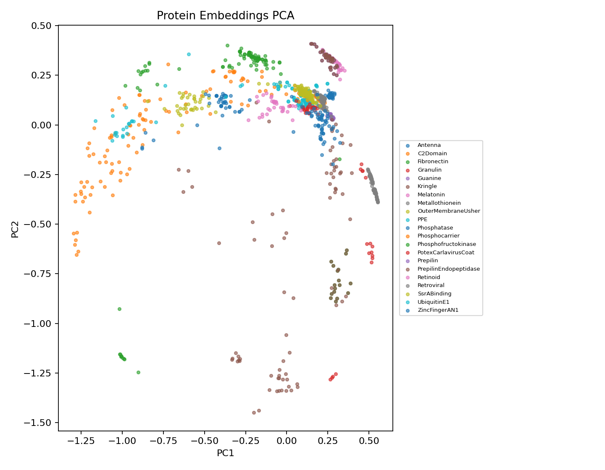

Few-Shot Protein Family Classification with Prototypical Networks

Metric learning for biological sequence understanding 
    • CNN encoder 
    • Embedding analysis 
    • Interactive visualization

Overview

Built an end-to-end few-shot learning system for classifying protein families using Prototypical Networks and a 1D CNN encoder.

Motivation

Most protein families have very few labeled examples. Traditional supervised learning fails when:
	•	a class has <10 sequences
	•	new families emerge with almost zero examples
	•	datasets are heavily imbalanced

Few-shot learning directly addresses this by training the model to generalize from N-way K-shot episodes.

This project answers:

Can we learn a general-purpose embedding space where proteins cluster by family, and can we classify new families with as few as 5 examples?

Spoiler: Yes

1. Method Summary

Protein Sequence (amino acids)
        ↓
Tokenization + Padding
        ↓
1D CNN Encoder → 128-dim embedding
        ↓
Episode Sampler (N-way, K-shot)
        ↓
Prototype calculation (mean embedding per class)
        ↓
Cosine / Euclidean similarity to prototypes
        ↓
Query classification

Implements Prototypical Networks

📊 2. Results Summary

5-Way 5-Shot Classification (150 episodes)

Metric	Mean Accuracy	Std. Dev
Cosine Similarity	0.913	±0.079
Euclidean Distance	0.914	±0.087

Both metrics agree →
The embedding space is cleanly separable across families.

Confusion Matrix

Saved to: results/confusion_cosine.png
Shows which families overlap (useful for structural/functional similarity analysis).

Failure Case Analysis

Saved to: results/failures.json

Embedding Visualization

✔ PCA + UMAP projections

✔ Interactive analysis dashboard (Plotly)

✔ Family search & filtering

✔ Hover tooltips (norm, distances, family)

✔ Nearest-neighbor inspection

✔ Export filtered CSV / HTML

✔ Visual anatomy of embedding clusters

Artifacts generated in results/:

pca_embeddings.png
confusion_cosine.png
plot_interactive.html
filtered_embeddings.csv
embeddings.json
kq_grid.png
failures.json
summary.json

Notebook:
notebooks/03_visualization_dashboard.ipynb

⸻

4. Repository Structure

protein-fewshot/
│
├── README.md                    # ← You are here
├── requirements.txt
├── LICENSE
│
├── data/
│   └── encoded/                 # Protein families (.pt)
│
├── models/
│   ├── encoder_cnn.py           # 1D CNN encoder
│   └── prototypical.py          # ProtoNet utilities
│
├── notebooks/
│   ├── 01_export_embeddings.ipynb
│   ├── 02_fewshot_evaluation.ipynb
│   └── 03_visualization_dashboard.ipynb
│
├── scripts/
│   ├── export_embeddings.py
│   ├── eval_episodes.py
│   └── build_dashboard_data.py
│
└── results/
    ├── embeddings.json
    ├── summary.json
    ├── pca_embeddings.png
    ├── confusion_cosine.png
    ├── plot_interactive.html
    ├── filtered_embeddings.csv
    ├── failures.json
    └── kq_grid.png

5. Installation

git clone https://github.com/<your-username>/protein-fewshot
cd protein-fewshot
pip install -r requirements.txt

Running the Pipeline

1. Export embeddings

python scripts/export_embeddings.py

2. Run episodic evaluation 

python scripts/eval_episodes.py

3. Explore embeddings 

Open:

notebooks/03_visualization_dashboard.ipynb

4. Optional Streamlit Dashboard

streamlit run app/streamlit_app.py

⸻

Qualitative Tools

Nearest-Neighbour Lookup

nearest_neighbours(idx=10, k=10)

Family Similarity Exploration

Inspect families that naturally cluster in embedding space.

Failure Inspection

Open the JSON:

results/failures.json