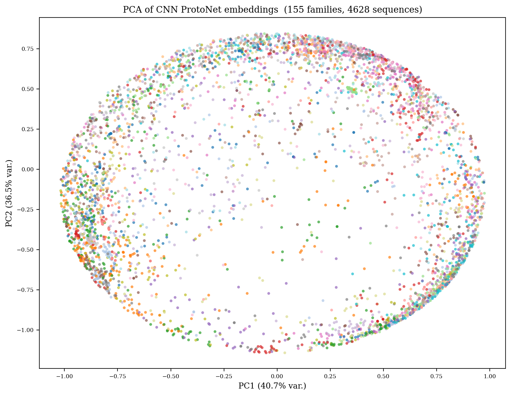
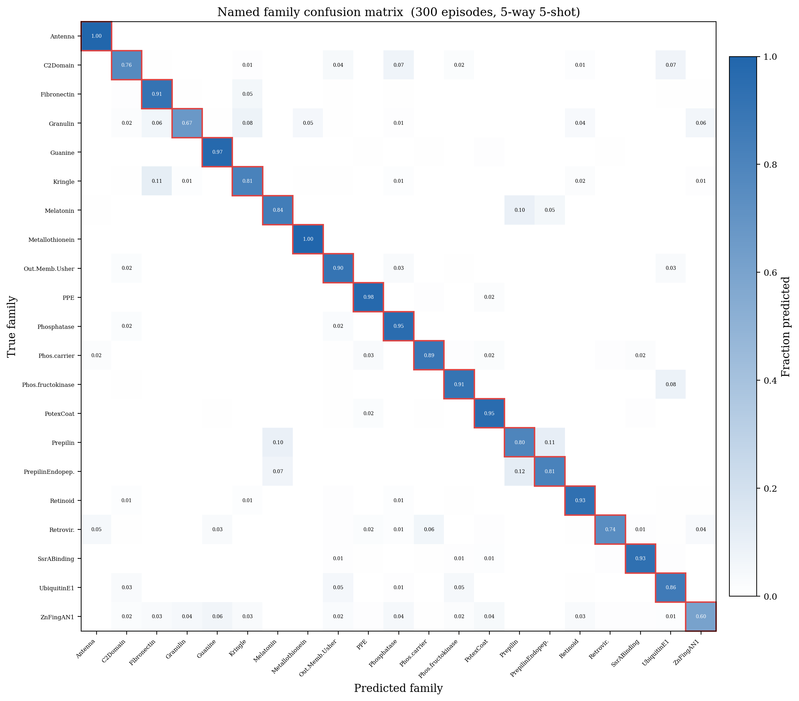

# Affinity Map: Few-Shot Protein Classification

**Affinity Map** is a meta-learning framework designed to classify proteins into functional families using only a handful of examples ($K$-shot learning). By leveraging **Prototypical Networks** and **ESM-2 Protein Language Models**, this project enables the annotation of rare or novel protein sequences where traditional HMM-based methods (like Pfam) fail due to data scarcity.

---

## Key Highlights
- **State-of-the-Art Foundation Models:** Utilizes Meta’s **ESM-2 (8M to 650M parameters)** as a sequence encoder.
- **Novel Research Insight:** Discovered a $K$-dependent interaction where **LoRA (Low-Rank Adaptation)** episodic fine-tuning improves single-shot ($K=1$) accuracy by +2.5% but requires specific regularization for multi-shot scenarios.
- **Rigorous Benchmarking:** Evaluated against BLAST (bioinformatics gold standard) and k-mer compositional baselines.

---

## Methodology
The pipeline treats protein classification as an **episodic task**:
1. **Encoding:** Raw amino acid sequences are embedded into a high-dimensional metric space.
2. **Prototyping:** A "Class Prototype" is calculated as the mean embedding of $K$ support sequences.
3. **Classification:** Query sequences are assigned to the family of the nearest prototype via Cosine Similarity.

### Model Tiers Evaluated:
| Encoder | Params | Accuracy (5-way 5-shot) |
| :--- | :--- | :--- |
| **1D-CNN (From Scratch)** | 228K | 71.0% |
| **k-mer ProtoNet** | N/A | 86.2% |
| **ESM-2 (Frozen)** | 8M | **88.7%** |
| **ESM-2 + LoRA** | 8M + 61K | **91.3%** ($K=1$ Optimized) |

---

## Results & Visualization
The model learns a biologically meaningful embedding space where proteins cluster by structural and functional similarity.

<div align="center">
  
  
</div>

*Top : PCA projection of protein embeddings. Bottom: Confusion matrix showing structural overlaps between families like Immunoglobulins and Cupins.*

---

## Installation & Usage

### 1. Setup Environment
```bash
git clone https://github.com/mderaznasr/Protein-fewshot.git
cd Protein-fewshot
python3 -m venv venv
source venv/bin/activate
pip install -r requirements.txt
```

### 2. Run Inference / Evaluation
```bash
# Evaluate the best ESM-2 LoRA checkpoint
python3 script/run_experiments.py --model esm2_lora --k_shot 5
```

---

## 📄 Documentation & Paper
For a deep dive into the mathematical framework and statistical significance tests, see the full paper:
- **Paper:** [`paper/affinity_map_paper.pdf`](paper/affinity_map_paper.pdf)
- **Tech Stack:** PyTorch, HuggingFace (Peft/Transformers), Biopython, Scikit-learn, UMAP, Streamlit.

---
*Developed by Mohammed El-Raznasr at Georgia Institute of Technology.*
